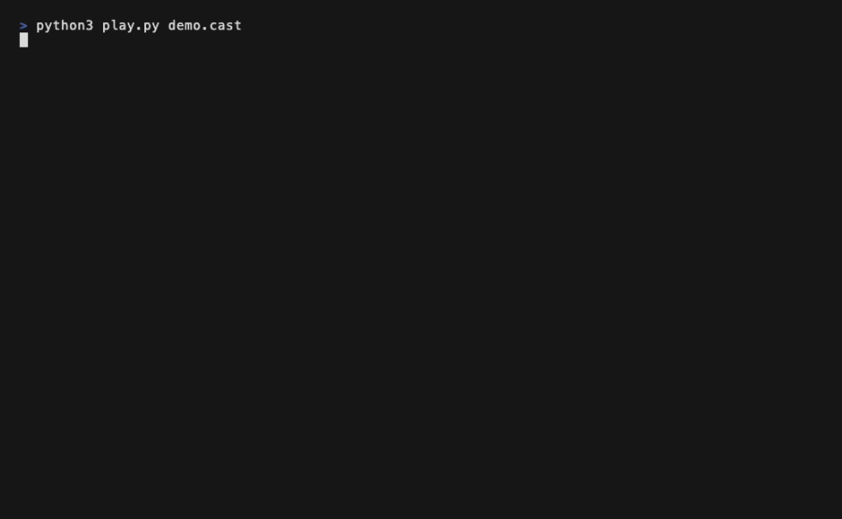

# ratslate

An infinite canvas in the terminal. Boxes, arrows and text, placed and moved
with the mouse — and written out as ASCII, so the drawing can live in a README
or a comment rather than only on the screen it was made on.



Reads and writes [JSON Canvas](https://jsoncanvas.org) (`.canvas`), the format
Obsidian's Canvas uses, so a board can round-trip through Obsidian — negative
coordinates, groups, file and link cards included, every coordinate saved back
exactly where the other tool put it.

## What's on a board

- **Boxes** — drag empty canvas to place one, type into it, double-click to
  edit. `c` cycles colors, or use the `●` button for a picker with hex swatches.
- **Connectors** — shift+drag from one box to another. Sides, arrowheads,
  colors and labels all editable; JSON Canvas `fromSide`/`toSide`/`fromEnd`/
  `toEnd` respected.
- **Tables** — a box whose text is a GFM markdown table renders as a real
  grid. Double-click a cell to edit it spreadsheet-style (Tab/Enter/arrows,
  `+col -col +row -row` buttons, Alt+Enter for a line break, Ctrl+Z inside the
  session). Still plain markdown in the file — Obsidian renders it as a table.
  Connectors can anchor to a table's row, column or single cell, and stay
  anchored when things move.
- **Groups** — draw a box around things, press `g`. Moving the fence moves
  everything inside it.
- **Files & links** — JSON Canvas file/link cards: `o` opens them (creating
  the file if it doesn't exist yet), `y` copies the path or URL.

The canvas is an infinite plane: pan with arrow keys or the mouse wheel, and
the minimap in the corner (toggle `m`) shows where everything is — click or
drag it to jump.

## Written out as ASCII

```sh
ratslate board.canvas --render
```

prints the whole board — tables, connectors, groups — exactly as the TUI
draws it, ready to paste into a doc, a PR, or a commit message.

## `--api`

Every mouse drag and keystroke is also a `Request` value, and there is
exactly one function that applies one: `dispatch`. `--api` is that
same function reached from the command line instead of a terminal —
not a second implementation of what a move or an edit means.

```sh
ratslate board.canvas --schema     # what a request/response looks like
ratslate board.canvas --api '{"type":"place","x":2,"y":2}'
ratslate board.canvas --api '[{"type":"set_text","id":"n1a2b3c4d","text":"hello"},{"type":"save"}]'
ratslate board.canvas --api '{"type":"render"}'   # the ASCII render, as JSON
```

A JSON array runs as a batch, applied in order, replied to in order.
Nothing is written to disk until a `save` request says so — `--api` is
safe to use for a read-only `state` query.

## Boards as launchers

Set `RATSLATE_OPENER` to any command and `o` hands it what's selected —
a box's text, a file's path, a link's URL, or the exact table cell
under the cursor. The opener decides what "open" means: jump to a
terminal pane, open a ticket, anything nameable in text. Unset, `o`
opens file and link boxes through the OS as usual.

## Humans and agents, live

Edits sync through a CRDT sidecar (`.canvas.crdt`, [yrs](https://github.com/y-crdt/y-crdt)):
a person dragging boxes in the TUI and an agent placing them through `--api`
merge live, field by field, instead of overwriting each other's saves. The
`.canvas` file itself stays clean JSON Canvas.

## Install

```sh
cargo install ratslate
```

## License

MIT or Apache-2.0, at your option.
